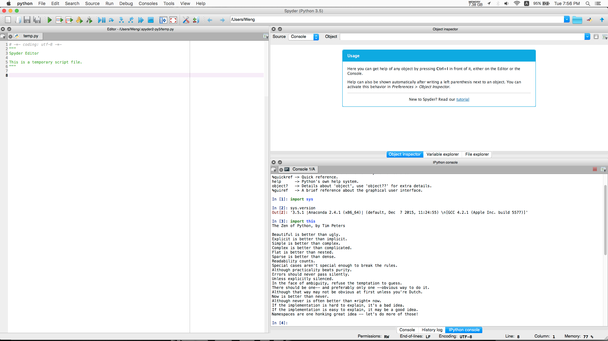
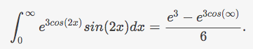
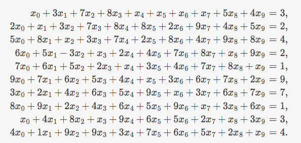
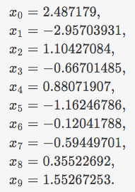

UECM3033 Assignment #1 Report
========================================================

- Prepared by: **Wong Chun Weng**
- Tutorial Group: **T2**

--------------------------------------------------------

## Task 1 -- setup a github repository

The reports, codes and supporting documents are uploaded to Github at: 

[https://github.com/wongcw30utar/UECM3033_assign1](https://github.com/wongcw30utar/UECM3033_assign1)

---------------------------------------------------------

## Task 2 -- setup python

Below is **python.png**.

------------------------------------------------------------

## Task 3 -- modify and run Python script

1. The hexadecimal value of your student ID.
	- Hexadecimal representation of 1203938 is 0x125ee2

2. Write down the definite integrals that you have chosen.
	- $$\int_0^{\infty} e^{3 cos(2x)}sin(2x) dx = \frac{e^{3} - e^{3cos(\infty)}}{6}.$$
	
	- 

3. Write down your system of 10 linear equations.
	- \begin{align*}
x_0 + 3 x_1 + 7 x_2 + 8 x_3 + x_4 + x_5 + x_6 + x_7 + 5 x_8 + 4 x_9  &= 3,\\
2 x_0 + x_1 + 3 x_2 + 7 x_3 + 8 x_4 + 8 x_5 + 2 x_6 + 9 x_7 + 4 x_8 + 5 x_9  &= 2,\\
5 x_0 + 8 x_1 +  x_2 + 3 x_3 + 7 x_4 + 2 x_5 + 8 x_6 + 4 x_7 + 9 x_8 + 8 x_9  &= 4,\\
6 x_0 + 5 x_1 - 3 x_2 + x_3 + 2 x_4 + 4 x_5 + 7 x_6 + 8 x_7 + x_8 + 9 x_9  &= 2,\\
7 x_0 + 6 x_1 + 5 x_2 + 2 x_3 + x_4 + 3 x_5 + 4 x_6 + 7 x_7 + 8 x_8 + x_9  &= 1,\\
9 x_0 + 7 x_1 + 6 x_2 + 5 x_3 + 4 x_4 + x_5 + 3 x_6 + 6 x_7 + 7 x_8 + 2 x_9  &= 9,\\
3 x_0 + 2 x_1 + 4 x_2 + 6 x_3 + 5 x_4 + 9 x_5 + x_6 + 3 x_7 + 6 x_8 + 7 x_9  &= 7,\\
8 x_0 + 9 x_1 + 2 x_2 + 4 x_3 + 6 x_4 + 5 x_5 + 9 x_6 + x_7 + 3 x_8 + 6 x_9  &= 1,\\
 x_0 + 4 x_1 + 8 x_2 + x_3 + 9 x_4 + 6 x_5 + 5 x_6 + 2 x_7 + x_8 + 3 x_9  &= 3,\\
4 x_0 + 1 x_1 + 9 x_2 + 9 x_3 + 3 x_4 + 7 x_5 + 6 x_6 + 5 x_7 + 2 x_8 + x_9 &= 4.
\end{align*}

	- 
	
	- **Answer:** \begin{align*} x_0 &= 2.487179, \\
x_1 &= -2.95703931, \\
x_2 &= 1.10427084, \\
x_3 &= -0.66701485, \\
x_4 &= 0.88071907, \\
x_5 &= -1.16246786, \\
x_6 &= -0.12041788, \\
x_7 &= -0.59449701,\\
x_8 &= 0.35522692, \\
x_9 &=1.55267253. 
\end{align*}

	- **Answer:** 

**P/S: As Github markdown doesn't render equations well, so screenshots are embedded**

-----------------------------------

last modified: 2016-01-26 8:40 PM
